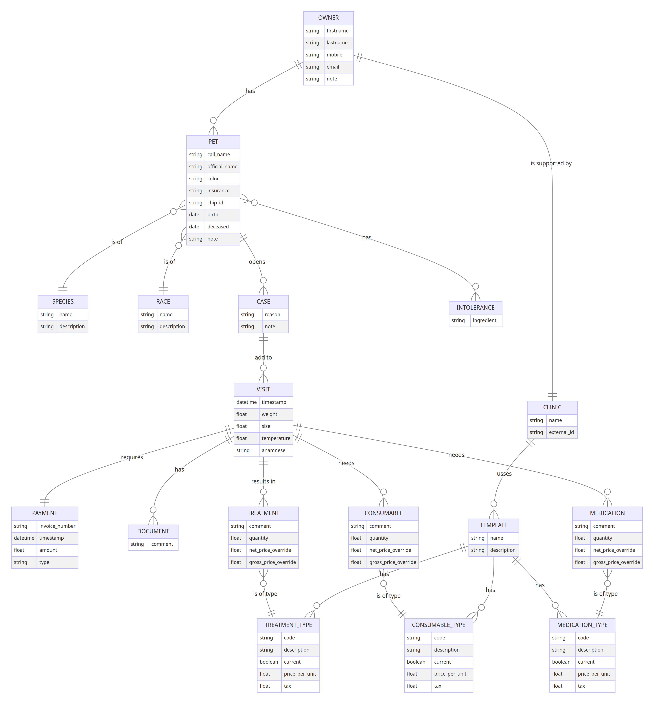

# vet_client

Web-based tool to manage the daily work in a veterinary clinic.

[![python version][7]][8] [![django version][9]][10]  [![black][18]][19]

## Use Cases

* Add owner with two addresses (postal and billing), as well as contact data
* Add one or more pets to an owner
    * add documents to a pet
* Add one or more cases for a pet
    * add documents to a case
* Add one or more visits for a case
    * add documents to a visit
* Payment is done on a visit basis
* Add treatments, medication and consumables to a visit
* Use prices for treatments from GOT2022
* Create templates for reoccurring treatment(s) and/or medications and/or consumables
* "fit" the sum to ensure flat prices (no cents)
* all prices can be overwritten, either as net or as gross

* Overview of all visits for a specific day (default today)

* generate an invoice for each visit, either automatically or with some manual overwrite

* waiting room function:
    * customer self register (incl pet)
    * separate list for the doctor, so he can "confirm" the data, before saving

### specifics

* translation ready
* 2FA

The two fonts are included for the creation of pdf files (invoices). 
This might be helpful when modify the template yourself.


## Security

two-factor authorization is added: see -> django-two-factor-auth
sesionmiddleware is used for filtering requests to documents

## Entities

### Owner


### Relationship




## Build and Develop

```sh
pip install -r requirements.txt

. ~/virtualenv/vet_client/bin/activate

python manage.py loaddata client/sample.yaml

django-admin makemessages --all --ignore=env  
django-admin compilemessages --ignore=env   
```

```sh
# build an image for the cloud container
docker buildx build --platform=linux/amd64 -t vet .

# prepare for deployment
docker tag vet stevwyman/vet
docker push stevwyman/vet

# running
docker run -p 8003:8003 client

docker ps
docker exec -it <id> bash -l
```


### Notes

[1]: https://img.shields.io/pypi/v/martor.svg
[2]: https://pypi.python.org/pypi/martor

[3]: https://img.shields.io/badge/donate-paypal-blue
[4]: https://www.paypal.com/paypalme/summonagus

[5]: https://img.shields.io/badge/license-GNUGPLv3-blue.svg
[6]: https://raw.githubusercontent.com/agusmakmun/django-markdown-editor/master/LICENSE

[7]: https://img.shields.io/pypi/pyversions/martor.svg
[8]: https://pypi.python.org/pypi/martor

[9]: https://img.shields.io/badge/Django-3.2%20%3E=%204.1-green.svg
[10]: https://www.djangoproject.com

[11]: https://img.shields.io/github/actions/workflow/status/agusmakmun/django-markdown-editor/run-tests.yml?branch=master
[12]: https://github.com/agusmakmun/django-markdown-editor/actions/workflows/run-tests.yml

[13]: https://github.com/agusmakmun/django-markdown-editor/wiki
[14]: https://github.com/agusmakmun/django-markdown-editor/tree/master/martor_demo/app/templates
[15]: https://github.com/adi-/django-markdownx
[16]: https://github.com/waylan/Python-Markdown
[17]: http://rst.ninjs.org

[18]: https://img.shields.io/badge/code%20style-black-000000.svg
[19]: https://github.com/ambv/black